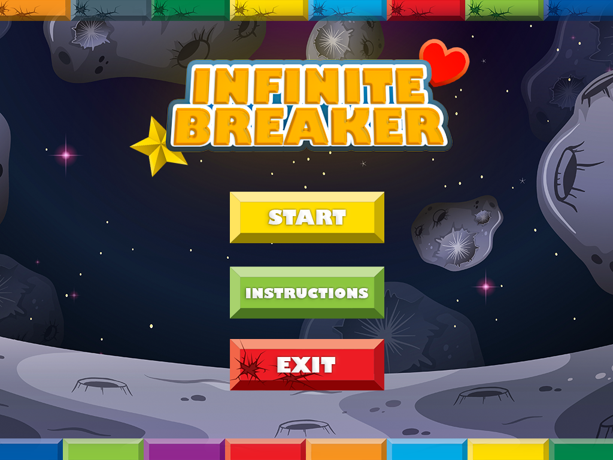
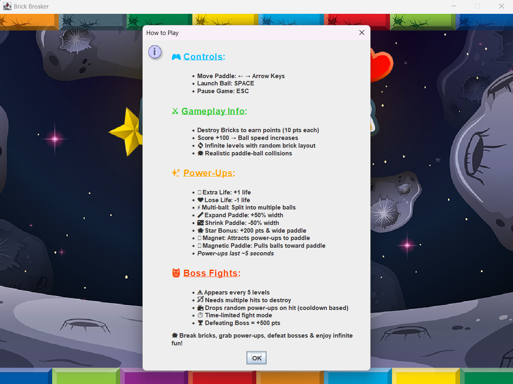
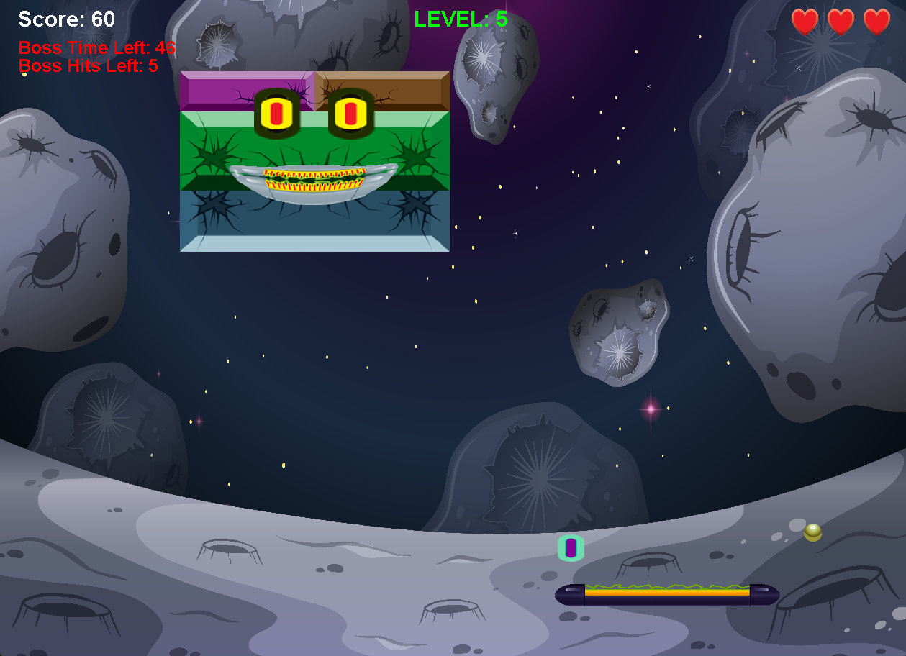

# 🧱 Brick Breaker Game

A classic arcade-style Brick Breaker game made with Java, featuring power-ups, boss fights, and infinite fun!  
Built with ❤️ using Java 23 and packaged to run on **any Windows machine**, with or without Java installed.

---

## 🎮 Features

- 🧲 Power-ups (Extra Life, Multi-Ball, Paddle Size, Magnet, and more)
- 🧠 Intelligent Paddle-Ball Collision Mechanics
- 💥 Realistic Sound Effects
- 👾 Boss Bricks with increasing difficulty
- 🌈 Random Brick Regeneration
- ⚙️ Pause Menu and Game State Management
- 🧲 Magnet-based power-ups and paddle attraction
- 🔊 Centralized music player for background and effects (Cool Sound-effects and Background Music for each Screen)

---

## 🚀 How to Play

- **Move Paddle**: ← → Arrow Keys  
- **Launch Ball**: `SPACE`  
- **Pause Game**: `ESC`  

Your goal: Break all bricks, collect power-ups, defeat boss bricks, and aim for high scores!

---

## 📸 Screenshots

Here are some snapshots of the gameplay experience:

  
  
  


---

## 🖥️ How to Run

### 🔵 For Windows Users (No Java Required)
1. Download the latest `.zip` from the [Releases](https://github.com/YourUsername/BrickBreakerGame/releases) tab.
2. Extract the `.zip` file.
3. Double-click `BrickBreakerGame.exe` to start playing!

> ✅ No Java installation needed – a custom Java runtime is bundled inside.

### ☕ For Developers (With Java Installed)
1. Clone the repo or download the `.jar` file.
2. Run with:
   ```bash
   java -jar BrickBreakerGame.jar
